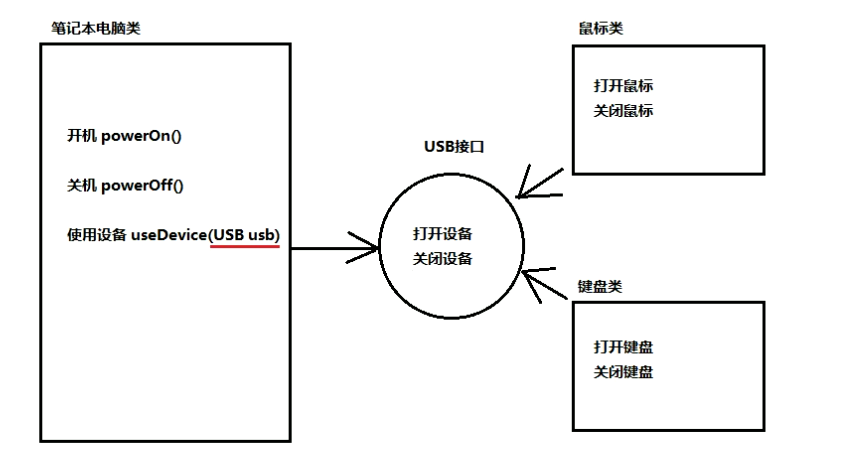

## 笔记本USB接口




##### 定义 USB 接口

```java
public interface USB {
    void enable();
    void disable();
}
```


##### 鼠标实现类

```java
// 鼠标是一种 USB 设备
public class Mouse implements USB {
    String name = "mouse";

    @Override
    public void enable() {
        System.out.println("enable " + this.name);
    }

    @Override
    public void disable() {
        System.out.println("disable " + this.name);
    }
	
    // 额外的点击动作
    public void click(){
        System.out.println("click on the event");
    }
}
```


##### 键盘实现类

```java
// 键盘也是一种 USB 设备
public class KeyBoard implements USB {
    String name = "key board";

    @Override
    public void enable() {
        System.out.println("enable " + this.name);
    }

    @Override
    public void disable() {
        System.out.println("disable " + this.name);
    }

    public void tap(){
        System.out.println("tap on a event");
    }
}
```


##### 电脑类

```java
public class MacBookPro {
    public void powerOn() {
        System.out.println("powerOn");
    }

    public void powerOff() {
        System.out.println("powerOff");
    }

    // 使用 USB 设备的方法，使用接口作为方法的参数
    public void useDevice(USB usb) {
        usb.enable();
        if (usb instanceof Mouse){
            // 向下转型
            Mouse mouse = (Mouse) usb;
            mouse.click();
        } else if (usb instanceof KeyBoard){
            KeyBoard keyBoard = (KeyBoard) usb;
            keyBoard.tap();
        }
        usb.disable();
    }
}
```


##### main

```java
public class DemoCase {
    public static void main(String[] args) {
        MacBookPro book = new MacBookPro();

        USB mouse = new Mouse();  // 多态写法，向上转型
        KeyBoard keyBoard = new KeyBoard();  // 自动发生了向上转型

        book.powerOn();  // powerOn
        book.useDevice(mouse);  // enable mouse, click on the event, disable mouse
        // 也可以直接传匿名对象 new KeyBoard()
        book.useDevice(keyBoard);  // enable key board, tap on a event, disable key board
        book.powerOff();  // powerOff
    }
}
```


###### 完 !


