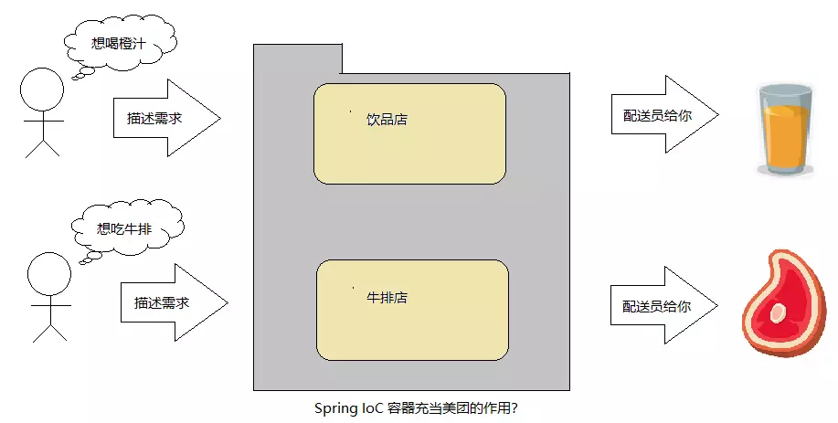

## 反转控制 IOC 详解

主动创建的模式中, 责任归于开发者, 而在被动的模式下, 责任归于 IOC 容器, **基于这样的被动形式，我们就说对象被控制反转了. (也可以说是反转了控制)**

### Spring IOC 容器

Spring 会提供 IOC 容器来管理和容纳我们所开发的各种各样的 bean, 并且我们可以从中获取各种发布在 Spring IOC 容器里的 bean, 并且**通过描述**可以得到它

### Spring IOC 容器的设计

Spring IOC 容器的设计主要是基于以下两个接口

1. BeanFactory
2. ApplicationContext

其中 ApplicationContext 是 BeanFactory 的子接口之一, 换句话说: BeanFactory 是 Spring IOC 容器所定义的最底层接口, 而 ApplicationContext 是其最高级接口之一, 并对 BeanFactory 功能做了许多的扩展, 所以在绝大部分的工作场景下, 都会使用 ApplicationContext 作为 Spring IOC 容器.

